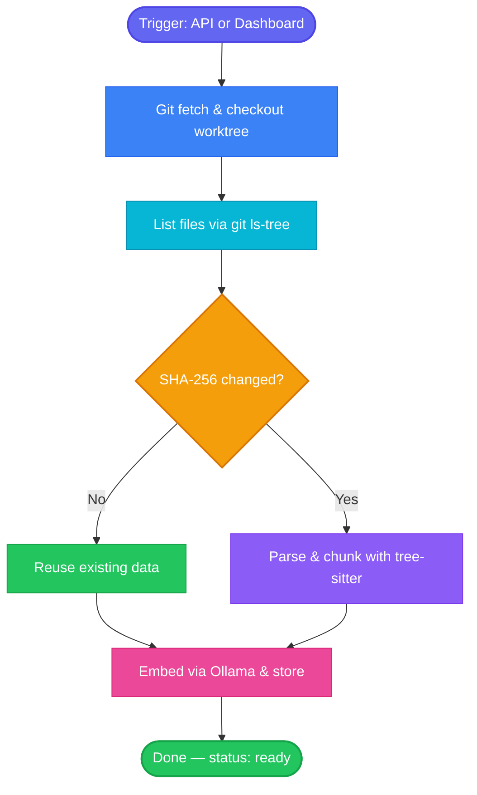

# Indexing Pipeline

Every indexing run follows the same full-index path — no special cases for first vs. subsequent runs.



## How SHA-256 Dedup Works

Dedup happens at two levels: whole files and individual chunks.

### File-level dedup

When the pipeline encounters a file:

1. Read the file content and compute its SHA-256 hash
2. Check if `file_contents` already has a row with that hash
3. **If yes**: create only the `ref_files` link (ref + path → existing file_contents). Skip parsing, chunking, and embedding entirely.
4. **If no**: parse the file, extract symbols, create chunks, generate embeddings, and store everything.

This means re-indexing a branch where 95% of files are unchanged only processes the 5% that changed — without needing `git diff` or knowledge of what was indexed before.

### Chunk-level dedup

File-level dedup only helps when a file is *byte-identical*. A single-line change higher up in a file changes the file hash, so in isolation every chunk below would be re-embedded — even when the chunk bodies (individual functions, markdown sections, etc.) are unchanged.

To catch that case, every chunk stores a `content_sha256` alongside the content itself. Before dispatching chunks to the embedding provider, the pipeline looks up any hashes that already have an embedding anywhere in the DB and copies those vectors in-place. Only the true cache misses hit Ollama/OpenAI.

The pipeline emits a `chunk-cache` progress event showing `{chunksReused, chunksToEmbed}` so the savings are visible in the worker log and admin dashboard. This is most impactful when bumping a repo across versions — most function bodies don't change between minor releases, so the chunk cache typically eliminates the majority of embedding work.

## Glob Patterns

Repos can have glob patterns (stored as `text[]` on the `repos` table) that filter which files are indexed. Patterns use `minimatch` with AND conjunction — all patterns must match for a file to be included. An empty array includes all files.

Configure via the admin dashboard or `PATCH /api/repos/:name`:

```bash
curl -X PATCH http://localhost:3001/api/repos/my-repo \
  -H 'content-type: application/json' \
  -d '{"globPatterns": ["src/**", "!**/*.test.ts"]}'
```

## Error Handling

- Each file is processed in isolation — a parse error in one file doesn't stop the pipeline
- `file-skipped` events are emitted for unsupported or too-large files
  (default cap: 3 MB per file; also skipped if average line length > 500 chars,
  which catches minified/generated bundles)
- `file-error` events are emitted for parse failures
- Progress is broadcast in real-time via PostgreSQL `LISTEN/NOTIFY`
