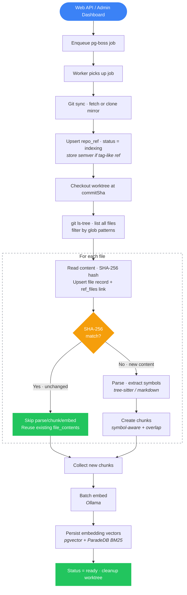

# Indexing Pipeline

Every indexing run follows the same full-index path — no special cases for first vs. subsequent runs.



## How SHA-256 Dedup Works

When the pipeline encounters a file:

1. Read the file content and compute its SHA-256 hash
2. Check if `file_contents` already has a row with that hash
3. **If yes**: create only the `ref_files` link (ref + path → existing file_contents). Skip parsing, chunking, and embedding entirely.
4. **If no**: parse the file, extract symbols, create chunks, generate embeddings, and store everything.

This means re-indexing a branch where 95% of files are unchanged only processes the 5% that changed — without needing `git diff` or knowledge of what was indexed before.

## Glob Patterns

Repos can have glob patterns (stored as `text[]` on the `repos` table) that filter which files are indexed. Patterns use `minimatch` with AND conjunction — all patterns must match for a file to be included. An empty array includes all files.

Configure via the admin dashboard or `PATCH /api/repos/:name`:

```bash
curl -X PATCH http://localhost:3001/api/repos/my-repo \
  -H 'content-type: application/json' \
  -d '{"globPatterns": ["src/**", "!**/*.test.ts"]}'
```

## Error Handling

- Each file is processed in isolation — a parse error in one file doesn't stop the pipeline
- `file-skipped` events are emitted for unsupported or too-large files
- `file-error` events are emitted for parse failures
- Progress is broadcast in real-time via PostgreSQL `LISTEN/NOTIFY`
